# 📊 Análisis Técnico: WAC, COGS, Margen Bruto y Pour Cost

**Proyecto:** BackStage POS - Dashboard Operativo  
**Fecha de análisis:** 2026-02-15  
**Versión:** 1.0  
**Autor:** Análisis exhaustivo del workspace

---

## 📌 Resumen Ejecutivo

Este documento describe de manera exhaustiva el método de cálculo del **WAC (Weighted Average Cost)**, el **COGS (Cost of Goods Sold)**, el **Margen Bruto** y el **Pour Cost** en el sistema BackStage POS. Incluye el flujo completo desde las recetas hasta la visualización en el dashboard, identifica las vistas SQL involucradas, y documenta las inconsistencias y redundancias detectadas durante el análisis.

---

## 🎯 Índice

1. [Método de Cálculo del WAC](#1-método-de-cálculo-del-wac)
2. [Flujo de Cálculo del COGS](#2-flujo-de-cálculo-del-cogs)
3. [Cálculo del Margen Bruto](#3-cálculo-del-margen-bruto)
4. [Cálculo del Pour Cost](#4-cálculo-del-pour-cost)
5. [Arquitectura de Vistas SQL](#5-arquitectura-de-vistas-sql)
6. [Implementación en el Dashboard](#6-implementación-en-el-dashboard)
7. [Inconsistencias y Redundancias Detectadas](#7-inconsistencias-y-redundancias-detectadas)
8. [Recomendaciones](#8-recomendaciones)
9. [Apéndices](#9-apéndices)

---

## 1. Método de Cálculo del WAC

### 1.1 Definición

**WAC** (Weighted Average Cost) o **Costo Promedio Ponderado** es el método de valoración de inventario utilizado en el sistema. Consiste en calcular un precio unitario promedio de cada producto considerando todos sus ingresos históricos, ponderados por la cantidad de cada ingreso.

### 1.2 Fórmula Matemática

```
WAC = Σ(cantidad_ingreso × precio_costo) / Σ(cantidad_ingreso)
```

**Donde:**
- `cantidad_ingreso`: cantidad de unidades recibidas en cada ingreso al almacén
- `precio_costo`: precio unitario de costo en cada ingreso
- Σ: sumatoria de todos los ingresos históricos habilitados

### 1.3 Fuente de Datos

La **fuente única de verdad** para el WAC es la vista SQL:
- **`vw_wac_producto_almacen`** (también referenciada como `vw_wac_global_producto`)

Esta vista:
- ✅ Calcula el WAC histórico **global**
- ✅ Se basa en todos los ingresos habilitados de la tabla `alm_ingreso`
- ✅ Es **independiente de la operativa actual**
- ✅ No se recalcula retroactivamente (el pasado permanece estable)

### 1.4 Características del Método

| Característica | Descripción |
|---------------|-------------|
| **Tipo** | Promedio ponderado histórico |
| **Alcance temporal** | Global (todos los ingresos históricos) |
| **Recálculo** | No se recalcula el pasado |
| **Actualización** | Se actualiza con cada nuevo ingreso |
| **Independencia operativa** | Sí (no varía por operación) |
| **Métodos NO utilizados** | FIFO, LIFO, Identificación específica |

### 1.5 Ejemplo Práctico

**Producto:** Ron Santa Teresa 750ml

| Fecha | Ingreso # | Cantidad | Precio Unitario | Costo Total |
|-------|-----------|----------|----------------|-------------|
| 2025-01-10 | ING-001 | 12 botellas | Bs 85.00 | Bs 1,020.00 |
| 2025-02-05 | ING-002 | 24 botellas | Bs 88.00 | Bs 2,112.00 |
| 2025-02-20 | ING-003 | 18 botellas | Bs 87.50 | Bs 1,575.00 |

**Cálculo WAC:**
```
WAC = (1,020 + 2,112 + 1,575) / (12 + 24 + 18)
WAC = 4,707 / 54
WAC = Bs 87.17 por botella
```

Este WAC de **Bs 87.17** es el que se usa para valorar **cada unidad consumida** de este producto en cualquier comanda, independientemente de qué lote físico se usó realmente.

---

## 2. Flujo de Cálculo del COGS

### 2.1 Definición

**COGS** (Cost of Goods Sold) o **Costo de Ventas** es el costo total de los insumos consumidos para producir lo vendido. En el contexto de un bar/restaurante, representa el costo de los ingredientes/bebidas que se utilizaron para preparar los productos vendidos.

### 2.2 Arquitectura del Pipeline de Cálculo

El COGS se calcula mediante un **pipeline de vistas en cascada**:

```mermaid
graph TD
    A[Recetas + Ventas] --> B(vw_combo_detalle_operacion)
    B --> C{Split Lógico}
    C -- Combos --> D[vw_cogs_comanda_combos]
    C -- Directos --> E[vw_cogs_comanda_comandables]
    D & E --> F[vw_cogs_comanda_unificada]
    F --> G[vw_cogs_comanda]
    G --> H[vw_margen_comanda]
    H --> I[Dashboard KPI]
```



### 2.3 Descripción de Cada Vista

#### 2.3.1 `vw_combo_detalle_operacion`
- **Función:** Primer nivel de agregación
- **Entrada:** Datos de ventas (comandas) + definiciones de productos
- **Procesamiento:** 
  - Desagrega combos en sus componentes individuales
  - Resuelve productos compuestos
  - Aplica recetas y factores de conversión
- **Salida:** Una fila por cada insumo consumido en cada producto vendido

#### 2.3.2 `vw_cogs_comanda_combos` ⚠️ **CRÍTICA**
- **Función:** Núcleo del cálculo de COGS para combos y tragos
- **Entrada:** `vw_combo_detalle_operacion` (cantidades) + `vw_wac_producto_almacen` (costos)
- **Procesamiento:**
  ```sql
  COGS_combo = SUM(
      (CASE WHEN ind_paq_detalle=1 
            THEN cantidad 
            ELSE cantidad/factor 
       END) × wac_global
  )
  GROUP BY id_comanda
  ```
- **Corrección Aplicada (2026-02-13):**
  - ❌ **ANTES:** Usaba una fuente que generaba múltiples filas por lote → duplicación de costos
  - ✅ **AHORA:** Usa `vw_wac_producto_almacen` como **única fuente** de costo unitario
- **Salida:** COGS total por comanda para productos tipo combo/trago

#### 2.3.3 `vw_cogs_comanda_comandables`
- **Función:** Calcula COGS para productos directos (no combos)
- **Entrada:** Productos vendidos directamente (ej. botellas cerradas, sodas)
- **Procesamiento:** Multiplicación simple: cantidad × WAC
- **Salida:** COGS total por comanda para productos comandables

#### 2.3.4 `vw_cogs_comanda_unificada`
- **Función:** Unificación de flujos
- **Procesamiento:** 
  ```sql
  SELECT * FROM vw_cogs_comanda_combos
  UNION ALL
  SELECT * FROM vw_cogs_comanda_comandables
  ```
- **Salida:** COGS completo (combos + comandables) sin agregar

#### 2.3.5 `vw_cogs_comanda`
- **Función:** Agregación final del COGS
- **Procesamiento:**
  ```sql
  SELECT 
      id_operacion,
      id_comanda,
      id_barra,
      SUM(cogs_comanda) as cogs_comanda
  FROM vw_cogs_comanda_unificada
  GROUP BY id_operacion, id_comanda, id_barra
  ```
- **Salida:** Una fila por comanda con su COGS total

#### 2.3.6 `vw_margen_comanda`
- **Función:** Vista final que consume el dashboard
- **Entrada:** `vw_cogs_comanda` (costos) + `bar_comanda` (ventas)
- **Procesamiento:**
  ```sql
  SELECT
      id_operacion,
      id_comanda,
      id_barra,
      SUM(sub_total) as total_venta,
      cogs_comanda,
      (SUM(sub_total) - cogs_comanda) as margen_comanda
  FROM ... JOIN vw_cogs_comanda
  ```
- **Salida:** Ventas, COGS y margen por comanda
- **Consumidor directo:** Dashboard (via `fetch_dataframe`)

### 2.4 Flujo de Datos Paso a Paso

**Ejemplo:** Venta de 1 Mojito en la comanda #12345

1. **Receta del Mojito:**
   - Ron blanco: 50 ml
   - Menta: 6 hojas
   - Azúcar: 15 g
   - Limón: 0.5 unidad
   - Soda: 150 ml
   - Hielo: 200 g

2. **vw_combo_detalle_operacion** desglosa:
   ```
   id_comanda: 12345
   producto: Mojito
   insumo: Ron blanco,    cantidad_base: 0.050 L
   insumo: Menta,         cantidad_base: 6 hojas
   insumo: Azúcar,        cantidad_base: 0.015 kg
   ... etc
   ```

3. **vw_cogs_comanda_combos** valoriza:
   ```
   Ron blanco: 0.050 L × Bs 120.00/L = Bs 6.00
   Menta:      6 hojas × Bs 0.15/hoja = Bs 0.90
   Azúcar:     0.015 kg × Bs 8.00/kg = Bs 0.12
   ... etc
   TOTAL COGS Mojito = Bs 8.50
   ```

4. **vw_cogs_comanda** agrega:
   ```
   Comanda 12345: COGS = Bs 8.50
   ```

5. **vw_margen_comanda** cruza con venta:
   ```
   Comanda 12345:
   - Venta:  Bs 35.00
   - COGS:   Bs 8.50
   - Margen: Bs 26.50
   ```

---

## 3. Cálculo del Margen Bruto

### 3.1 Definición

El **Margen Bruto** es la utilidad obtenida después de restar el costo de los insumos (COGS) del monto de ventas, antes de considerar gastos operativos.

### 3.2 Fórmulas

**Margen Bruto Absoluto (Bs):**
```
Margen = Ventas - COGS
```

**Margen Bruto Porcentual (%):**
```
Margen % = (Margen / Ventas) × 100
```

o equivalentemente:
```
Margen % = ((Ventas - COGS) / Ventas) × 100
```

### 3.3 Implementación SQL

En `vw_margen_comanda`:
```sql
SELECT
    id_operacion,
    id_comanda,
    SUM(sub_total) as total_venta,
    cogs_comanda,
    (SUM(sub_total) - cogs_comanda) as margen_comanda
FROM ...
```

En la consulta de resumen (`q_wac_cogs_summary`):
```sql
SELECT
    COALESCE(SUM(total_venta), 0) AS total_ventas,
    COALESCE(SUM(cogs_comanda), 0) AS total_cogs,
    COALESCE(SUM(margen_comanda), 0) AS total_margen,
    ROUND(
        COALESCE(SUM(margen_comanda), 0) 
        / NULLIF(COALESCE(SUM(total_venta), 0), 0) * 100,
        2
    ) AS margen_pct
FROM vw_margen_comanda
WHERE ...
```

### 3.4 Consideraciones de Negocio

**Filtro de Ventas Finalizadas:**
Solo se consideran comandas que cumplen:
- `tipo_salida = 'VENTA'`
- `estado_comanda = 'PROCESADO'`
- `estado_impresion = 'IMPRESO'`

**Exclusiones:**
- ❌ Cortesías (no tienen venta, pero sí COGS)
- ❌ Comandas pendientes
- ❌ Comandas anuladas

### 3.5 Ejemplo Práctico

**Operativa del día 2026-02-14:**

| Concepto | Monto |
|----------|-------|
| Total Ventas | Bs 12,450.00 |
| Total COGS | Bs 3,489.00 |
| **Margen Bruto** | **Bs 8,961.00** |
| **Margen %** | **71.98%** |

**Interpretación:**
- Por cada Bs 100 vendidos, el negocio retiene Bs 71.98 después de pagar los insumos
- Los Bs 28.02 restantes corresponden al costo de los insumos (pour cost)

---

## 4. Cálculo del Pour Cost

### 4.1 Definición

El **Pour Cost** (también conocido como "costo de vertido" o "ratio de costo de producto") es el porcentaje que representa el costo de los insumos respecto a las ventas totales. Es la **inversa complementaria** del margen porcentual.

### 4.2 Fórmula

```
Pour Cost % = (COGS / Ventas) × 100
```

**Relación con el Margen:**
```
Pour Cost % + Margen % = 100%
```

o:
```
Pour Cost % = 100% - Margen %
```

### 4.3 Implementación en el Dashboard

El Pour Cost se calcula en el servicio Python `get_wac_cogs_summary` en `src/metrics.py`:

```python
def get_wac_cogs_summary(
    conn: Any,
    view_name: str,
    filters: Filters,
    mode: str,
) -> dict[str, Any]:
    # ... ejecuta SQL ...
    
    total_ventas = _to_float(row.get("total_ventas"))
    total_cogs = _to_float(row.get("total_cogs"))
    
    # Cálculo de Pour Cost
    pour_cost_pct = (total_cogs / total_ventas * 100.0) if total_ventas > 0 else 0.0
    
    return {
        "total_ventas": total_ventas,
        "total_cogs": total_cogs,
        "total_margen": _to_float(row.get("total_margen")),
        "margen_pct": _to_float(row.get("margen_pct")),
        "pour_cost_pct": pour_cost_pct,  # ← Calculado aquí
    }
```

### 4.4 Visualización en la UI

En `src/ui/sections/margenes.py`, el Pour Cost se muestra con **indicadores visuales por umbrales**:

```python
# Umbrales de Pour Cost:
if 30 <= pour_cost_pct <= 40:
    st.success(pc_info, icon=":material/check_circle:")  # ✅ Verde (Óptimo)
elif (25 <= pour_cost_pct < 30) or (40 < pour_cost_pct <= 45):
    st.warning(pc_info, icon=":material/warning:")        # ⚠️ Amarillo (Aceptable)
else:
    st.error(pc_info, icon=":material/error:")            # 🔴 Rojo (Problema)
```

**Interpretación de umbrales:**

| Rango | Color | Significado |
|-------|-------|-------------|
| 30-40% | 🟢 Verde | **Óptimo** - Rentabilidad saludable |
| 25-30% | 🟡 Amarillo | Margen muy alto (verificar precios competitivos) |
| 40-45% | 🟡 Amarillo | Margen bajo (revisar costos/recetas) |
| < 25% o > 45% | 🔴 Rojo | **Alerta** - Revisar costos, recetas o precios |

### 4.5 Ejemplo Práctico

Continuando con el ejemplo de la operativa del 2026-02-14:

```
Pour Cost % = (3,489 / 12,450) × 100 = 28.02%
```

**Interpretación:**
- ✅ 28.02% está en el rango 25-30% → **Amarillo/Aceptable**
- Por cada Bs 100 de venta, se gastan Bs 28.02 en insumos
- El 71.98% restante es margen bruto para cubrir:
  - Gastos operativos (sueldos, servicios, alquiler)
  - Utilidad neta

### 4.6 Tooltip en la UI

```
"Pour Cost %"

Porcentaje que representa el costo de insumos (COGS) sobre las ventas.
Fórmula: (COGS / Ventas) × 100

Umbrales:
• 30-40%: Óptimo (verde)
• 25-30% o 40-45%: Aceptable (amarillo)
• Fuera de rango: Requiere revisión (rojo)

Relación: Pour Cost % + Margen % = 100%
```

---

## 5. Arquitectura de Vistas SQL

### 5.1 Diagrama de Dependencias

```
┌─────────────────────────────────────────────────────────────┐
│                   CAPAS DE DATOS                            │
├─────────────────────────────────────────────────────────────┤
│ CAPA 0: Tablas Base (MySQL)                                │
│  • alm_ingreso (ingresos de inventario)                    │
│  • alm_producto (maestro de productos)                     │
│  • bar_comanda (comandas/ventas)                           │
│  • bar_detalle_comanda_salida (ítems de comandas)         │
│  • ope_operacion (operativas/turnos)                       │
│  • parameter_table (catálogos/estados)                     │
├─────────────────────────────────────────────────────────────┤
│ CAPA 1: Vistas de Costo (WAC)                              │
│  ▶ vw_wac_producto_almacen                                 │
│    └─ Calcula WAC global por producto                      │
├─────────────────────────────────────────────────────────────┤
│ CAPA 2: Vistas de Recetas                                  │
│  ▶ vw_combo_detalle_operacion                              │
│    └─ Desglosa combos en componentes base                  │
├─────────────────────────────────────────────────────────────┤
│ CAPA 3: Vistas de COGS por Tipo                            │
│  ▶ vw_cogs_comanda_combos                                  │
│    └─ COGS para combos/tragos                             │
│  ▶ vw_cogs_comanda_comandables                             │
│    └─ COGS para productos directos                        │
├─────────────────────────────────────────────────────────────┤
│ CAPA 4: Vista de COGS Unificado                            │
│  ▶ vw_cogs_comanda_unificada                               │
│    └─ UNION de combos + comandables                       │
├─────────────────────────────────────────────────────────────┤
│ CAPA 5: Vista de COGS Agregado                             │
│  ▶ vw_cogs_comanda                                         │
│    └─ Agregación por comanda                              │
├─────────────────────────────────────────────────────────────┤
│ CAPA 6: Vista de P&L (Profit & Loss)                       │
│  ▶ vw_margen_comanda                                       │
│    └─ Cruza ventas con COGS → margen                      │
│    └─ FUENTE DIRECTA DEL DASHBOARD                        │
├─────────────────────────────────────────────────────────────┤
│ CAPA 7: Vistas Auxiliares de Diagnóstico                   │
│  ▶ vw_consumo_valorizado_operativa                         │
│    └─ Consumo por producto con WAC                        │
│  ▶ vw_consumo_insumos_operativa                            │
│    └─ Consumo por producto sin valorar                    │
│  ▶ vw_comanda_ultima_impresion                             │
│    └─ Log de impresión (diagnóstico alternativo)          │
│  ▶ comandas_v6 / comandas_v6_todas / comandas_v6_base      │
│    └─ Vistas para tiempo real y histórico                 │
└─────────────────────────────────────────────────────────────┘
```

### 5.2 Vistas Core del Sistema WAC/COGS

| Vista | Función | Inputs | Outputs |
|-------|---------|--------|---------|
| `vw_wac_producto_almacen` | Calcular WAC global | `alm_ingreso` | `id_producto`, `wac_global` |
| `vw_combo_detalle_operacion` | Desglosar recetas | `bar_comanda`, recetas | `id_comanda`, `id_insumo`, `cantidad_base` |
| `vw_cogs_comanda_combos` | COGS combos | Detalle + WAC | `id_comanda`, `cogs_comanda` (combos) |
| `vw_cogs_comanda_comandables` | COGS comandables | Ventas + WAC | `id_comanda`, `cogs_comanda` (directos) |
| `vw_cogs_comanda_unificada` | Unificar COGS | Combos + Comandables | `id_comanda`, `cogs_comanda` (todos) |
| `vw_cogs_comanda` | Agregar COGS | Unificada | `id_operacion`, `id_comanda`, `cogs_comanda` |
| `vw_margen_comanda` | P&L final | COGS + Ventas | `total_venta`, `cogs_comanda`, `margen_comanda` |

### 5.3 Vistas de Dashboard

| Vista | Modo | Alcance | Uso |
|-------|------|---------|-----|
| `comandas_v6` | Tiempo Real | Operativa activa | Dashboard en vivo |
| `comandas_v6_todas` | Histórico | Todas las operativas | Análisis retrospectivo |
| `comandas_v6_base` | Histórico | Base completa | Auditoría/backup |

---

## 6. Implementación en el Dashboard

### 6.1 Arquitectura de Software

El dashboard sigue una arquitectura en **3 capas**:

```
┌─────────────────────────────────────────────────────────┐
│                  UI Layer (Streamlit)                   │
│  • app.py (punto de entrada)                           │
│  • src/ui/sections/margenes.py (sección P&L)           │
│  • src/ui/formatting.py (formato Bolivia)              │
└──────────────────────┬──────────────────────────────────┘
                       │
                       ▼
┌─────────────────────────────────────────────────────────┐
│              Business Logic Layer (Python)              │
│  • src/metrics.py (servicios de negocio)               │
│    ├─ get_wac_cogs_summary() → P&L consolidado        │
│    ├─ get_wac_cogs_detalle() → P&L por comanda        │
│    ├─ get_consumo_valorizado() → Consumo con WAC      │
│    ├─ get_consumo_sin_valorar() → Consumo sin WAC     │
│    └─ get_cogs_por_comanda() → Solo COGS              │
└──────────────────────┬──────────────────────────────────┘
                       │
                       ▼
┌─────────────────────────────────────────────────────────┐
│               Data Access Layer (SQL)                   │
│  • src/query_store.py (consultas SQL)                  │
│    ├─ q_wac_cogs_summary() → SQL resumen              │
│    ├─ q_wac_cogs_detalle() → SQL detalle              │
│    ├─ q_consumo_valorizado() → SQL consumo+WAC        │
│    ├─ q_consumo_sin_valorar() → SQL solo consumo      │
│    └─ q_cogs_por_comanda() → SQL solo COGS            │
│  • src/db.py (conexión)                               │
│    └─ fetch_dataframe() → Ejecutor SQL                │
└──────────────────────┬──────────────────────────────────┘
                       │
                       ▼
┌─────────────────────────────────────────────────────────┐
│                Database (MySQL 5.6)                     │
│  • Vistas SQL (vw_margen_comanda, etc.)                │
│  • Tablas base (bar_comanda, alm_ingreso, etc.)       │
└─────────────────────────────────────────────────────────┘
```

### 6.2 Flujo de Ejecución (Usuario → SQL)

**Paso 1:** Usuario abre el dashboard
```python
# app.py
render_margenes_section(
    conn=conn,
    startup=startup,
    filters=filters,
    mode_for_metrics=mode_for_metrics,
    debug_fn=lambda e: st.error(str(e))
)
```

**Paso 2:** La sección llama al servicio de negocio
```python
# src/ui/sections/margenes.py
wac_cogs = get_wac_cogs_summary(
    conn, 
    "vw_margen_comanda", 
    filters, 
    mode_for_metrics
)
```

**Paso 3:** El servicio construye y ejecuta la consulta SQL
```python
# src/metrics.py
def get_wac_cogs_summary(conn, view_name, filters, mode):
    where_sql, params = build_where(filters, mode, table_alias="v")
    sql = q_wac_cogs_summary(view_name, where_sql)
    df = _run_df(conn, sql, params, context="...", ttl=...)
    
    # Calcula pour cost aquí
    pour_cost_pct = (total_cogs / total_ventas * 100.0) if total_ventas > 0 else 0.0
    
    return {
        "total_ventas": ...,
        "total_cogs": ...,
        "total_margen": ...,
        "margen_pct": ...,
        "pour_cost_pct": pour_cost_pct
    }
```

**Paso 4:** Se genera el SQL parametrizado
```python
# src/query_store.py
def q_wac_cogs_summary(view_name: str, where_sql: str) -> str:
    return f"""
    SELECT
        COALESCE(SUM(total_venta), 0) AS total_ventas,
        COALESCE(SUM(cogs_comanda), 0) AS total_cogs,
        COALESCE(SUM(margen_comanda), 0) AS total_margen,
        ROUND(...) AS margen_pct
    FROM {view_name} v
    {where_sql};
    """
```

**Paso 5:** Se ejecuta contra la base de datos
```python
# src/db.py → fetch_dataframe()
# Usa Streamlit Connections o mysql.connector
```

**Paso 6:** Los resultados se formatean y muestran
```python
# src/ui/sections/margenes.py
m1.metric("Ventas brutas", format_bs(total_ventas), help=...)
m2.metric("COGS", format_bs(total_cogs), help=...)
m3.metric("Margen bruto", format_bs(total_margen), help=...)
m4.metric("Margen %", f"{margen_pct:.2f} %", help=...)

# Pour Cost con indicador visual
if 30 <= pour_cost_pct <= 40:
    st.success(f"# {pour_cost_pct:.2f} %", icon="✅")
# ... etc
```

### 6.3 Formato Bolivia (Moneda y Números)

El sistema implementa el formato local de Bolivia:
- **Moneda:** `Bs 1.100,33` (miles con punto, decimales con coma)
- **Conteos:** `1.100` (miles con punto, sin decimales)

**Implementación centralizada en `src/ui/formatting.py`:**

```python
def _format_number_es(value: float, *, decimals: int) -> str:
    """Formato es/LatAm: miles con punto, decimales con coma"""
    s = f"{value:,.{int(decimals)}f}"  # 1,100.33 (formato US)
    return s.replace(",", "_").replace(".", ",").replace("_", ".")
    # Resultado: 1.100,33

def format_bs(value: Any, *, decimals: int = 2) -> str:
    """Formatea montos en Bolivianos"""
    x = _to_finite_float(value)
    sign = "-" if x < 0 else ""
    return f"{sign}Bs {_format_number_es(abs(x), decimals=decimals)}"
```

### 6.4 Tooltips/Ayudas en los KPIs

Cada métrica en la UI incluye un `help=` que explica:
- ✅ **Qué mide** (definición de negocio)
- ✅ **Qué incluye/excluye** (criterios de filtrado)
- ✅ **Contexto** (vista y filtros activos)

**Ejemplo - Tooltip de COGS:**
```python
m2.metric(
    "COGS",
    format_bs(total_cogs),
    help=(
        "Costo de los insumos consumidos (combos + comandables integrados). "
        "Utilizado para calcular la utilidad bruta."
    ),
    border=True,
)
```

**Ejemplo - Tooltip de Pour Cost:**
```
"Pour Cost %"

Porcentaje que representa el costo de insumos (COGS) sobre las ventas.
Fórmula: (COGS / Ventas) × 100

Umbrales:
• 30-40%: Óptimo (verde)
• 25-30% o 40-45%: Aceptable (amarillo)
• Fuera de rango: Requiere revisión (rojo)

Relación: Pour Cost % + Margen % = 100%
```

---

## 7. Inconsistencias y Redundancias Detectadas

### 7.1 ⚠️ Nomenclatura Inconsistente de la Vista WAC

**Problema:** La vista que calcula el WAC se referencia con dos nombres distintos en la documentación:

| Documento | Nombre Usado |
|-----------|--------------|
| `guia_tecnica_wac_cogs.md` | `vw_wac_producto_almacen` |
| `Documento_Maestro_COGS_WAC_BackStage_ACTUALIZADO.md` | `vw_wac_global_producto` |
| `consultas_cogs_wac.md` | No especifica nombre completo |

**Impacto:**
- 🔴 **Alto** - Confusión al auditar o depurar
- 🔴 **Alto** - Riesgo de buscar una vista que no existe
- 🟡 **Medio** - Puede causar errores al modificar consultas

**Recomendación:**
1. Verificar en la base de datos cuál es el nombre **real** de la vista:
   ```sql
   SHOW TABLES LIKE 'vw_wac%';
   ```
2. Estandarizar en toda la documentación al nombre correcto
3. Si existen ambas vistas, documentar:
   - Cuál es la oficial
   - Por qué existe la otra
   - Si son equivalentes o tienen diferencias

**Hipótesis:** `vw_wac_producto_almacen` y `vw_wac_global_producto` son **alias** o la segunda es una refactorización de la primera, pero no se documentó el cambio.

### 7.2 ⚠️ Referencias a Campos "wac_operativa" y "wac_global"

**Problema:** En la documentación de vistas auxiliares se mencionan dos tipos de WAC:

**En `vw_consumo_valorizado_operativa`:**
- Se menciona que tiene campos: `wac_operativa` y `wac_global`
- No se documenta la diferencia entre ambos
- No se especifica cuál se usa para el cálculo final

**En `vw_cogs_comanda_combos`:**
- Solo se menciona `wac.wac_global` como fuente de costo
- Implica que solo hay un WAC (el global)

**Contradicción:** Si el WAC es siempre "global" (histórico completo), ¿por qué existe `wac_operativa`?

**Hipótesis posibles:**
1. **Legado:** `wac_operativa` era un intento de calcular WAC por operativa (abandonado)
2. **Debugging:** `wac_operativa` existe solo para comparación/auditoría, no se usa en producción
3. **Error de documentación:** Solo existe `wac_global`, pero se copió texto antiguo

**Impacto:**
- 🟡 **Medio** - Puede causar confusión al analizar consumo valorizado
- 🟡 **Medio** - No queda claro qué columna usar si se quiere verificar costos

**Recomendación:**
1. Consultar el DDL de `vw_consumo_valorizado_operativa`:
   ```sql
   SHOW CREATE VIEW vw_consumo_valorizado_operativa;
   ```
2. Documentar explícitamente:
   - Si existen ambos campos, cuál es cuál y para qué sirve cada uno
   - Si solo existe uno, corregir la documentación
3. Agregar comentario en la vista SQL explicando la diferencia (si aplica)

### 7.3 ⚠️ Redundancia en Vistas de Consumo

**Problema:** Existen 3 vistas relacionadas con consumo de insumos:

| Vista | Función | Campos Clave |
|-------|---------|--------------|
| `vw_consumo_insumos_operativa` | Consumo sin valorar | `cantidad_consumida_base` |
| `vw_consumo_valorizado_operativa` | Consumo valorizado | `cantidad_consumida_base`, `wac_*`, `costo_consumo` |
| `vw_cogs_comanda` | COGS por comanda | `cogs_comanda` |

**Observación:**
- ✅ Cada una tiene un propósito claro y diferente
- ⚠️ Pero hay **redundancia parcial** en el cálculo de cantidades:
  - Las cantidades en `vw_consumo_insumos_operativa` deberían coincidir con las de `vw_consumo_valorizado_operativa`
  - Si no coinciden → indica error en la lógica de una de ellas

**Impacto:**
- 🟢 **Bajo** - Son vistas para propósitos distintos (sanidad vs valorización)
- 🟡 **Medio** - Si hay divergencias en cantidades, dificulta auditoría

**Recomendación:**
1. Crear query de validación:
   ```sql
   -- Verificar que cantidades coincidan entre vistas
   SELECT
       ci.id_producto,
       ci.cantidad_consumida_base AS cant_sin_valorar,
       cv.cantidad_consumida_base AS cant_valorizada,
       (ci.cantidad_consumida_base - cv.cantidad_consumida_base) AS diferencia
   FROM vw_consumo_insumos_operativa ci
   JOIN vw_consumo_valorizado_operativa cv
       ON cv.id_producto = ci.id_producto
      AND cv.id_operacion = ci.id_operacion
   WHERE ABS(ci.cantidad_consumida_base - cv.cantidad_consumida_base) > 0.0001
   ```
2. Ejecutar periódicamente como parte de QA
3. Si las cantidades difieren sistemáticamente, investigar y documentar por qué

### 7.4 ⚠️ Problema Corregido Pero No Versionado

**Contexto:** El `Documento_Maestro_COGS_WAC_BackStage_ACTUALIZADO.md` describe una corrección crítica aplicada el 2026-02-13:
- **Problema:** COGS inflado por duplicación de costos en combos
- **Causa:** Uso de fuente que devolvía múltiples filas por lote
- **Solución:** Cambiar a `vw_wac_global_producto` como fuente única

**Problema Detectado:**
- ✅ La solución está bien documentada
- ⚠️ **No hay evidencia en el código SQL** de la corrección aplicada
- ⚠️ No se indica si se creó un **backup de la vista anterior**
- ⚠️ No hay **número de versión** en las vistas SQL

**Impacto:**
- 🔴 **Alto** - Si se necesita revertir o auditar el cambio, no hay trazabilidad
- 🔴 **Alto** - No se puede verificar que la corrección esté aplicada en todos los entornos

**Recomendación:**
1. Implementar **versionado de vistas**:
   ```sql
   -- En cada CREATE OR REPLACE VIEW, agregar comentario:
   /* 
    * Vista: vw_cogs_comanda_combos
    * Versión: 2.0
    * Fecha: 2026-02-13
    * Cambio: Corrección de duplicación de costos (usa vw_wac_global_producto único)
    * Ticket: #WAC-001
    */
   CREATE OR REPLACE VIEW vw_cogs_comanda_combos AS ...
   ```
2. Mantener **scripts SQL versionados** en `docs/sql/` con nombres tipo:
   - `vw_cogs_comanda_combos_v1.0.sql` (versión original con bug)
   - `vw_cogs_comanda_combos_v2.0.sql` (versión corregida)
3. Agregar campo `version_aplicada` en una tabla de metadatos:
   ```sql
   CREATE TABLE IF NOT EXISTS sys_version_vistas (
       vista_nombre VARCHAR(100),
       version VARCHAR(10),
       fecha_aplicacion DATETIME,
       descripcion TEXT
   );
   ```

### 7.5 ℹ️ Documentación Dispersa (No es Error, Pero Puede Mejorar)

**Observación:** La información sobre WAC/COGS está distribuida en:
- `docs/wac_cogs/Documento_Maestro_COGS_WAC_BackStage_ACTUALIZADO.md` (teórico)
- `docs/wac_cogs/guia_tecnica_wac_cogs.md` (técnico)
- `docs/wac_cogs/consultas_cogs_wac.md` (consultas)
- `docs/02-guia_dashboard_backstage.md` (arquitectura general)
- Código en `src/query_store.py`, `src/metrics.py`

**Impacto:**
- 🟡 **Medio** - Dificulta onboarding de nuevos desarrolladores
- 🟡 **Medio** - Riesgo de documentación desincronizada

**Recomendación:**
- ✅ Este documento (`analisis_wac_cogs_margenes.md`) debería servir como **índice maestro**
- Mantener los documentos específicos, pero referenciarlos desde un punto central
- Agregar al README principal una sección "Documentación de COGS/WAC" que apunte aquí

### 7.6 📝 Resumen de Inconsistencias

| ID | Severidad | Tipo | Descripción | Estado |
|----|-----------|------|-------------|--------|
| INC-001 | 🔴 Alta | Nomenclatura | Dos nombres para vista WAC (`vw_wac_producto_almacen` vs `vw_wac_global_producto`) | ⚠️ Pendiente |
| INC-002 | 🟡 Media | Campos | Diferencia no documentada entre `wac_operativa` y `wac_global` | ⚠️ Pendiente |
| INC-003 | 🟡 Media | Lógica | Posible redundancia en cálculo de cantidades entre vistas de consumo | ⚠️ Pendiente |
| INC-004 | 🔴 Alta | Trazabilidad | Corrección crítica sin versionado ni backup | ⚠️ Pendiente |
| INC-005 | 🟢 Baja | Documentación | Información dispersa en múltiples archivos | ✅ Resuelto (este doc) |

### 7.7 🔎 DDL real en adminerp_copy (solo lectura)

Se consultó el DDL directamente en **adminerp_copy** (entorno de pruebas) mediante `SHOW CREATE VIEW`. Hallazgos relevantes:

- **`vw_wac_producto_almacen`**: calcula `wac_global` desde `alm_detalle_ingreso` + `alm_ingreso`.
  - Filtro: `i.estado='HAB'`, `di.estado='HAB'`, `i.ind_estado_ingreso=1`, `di.precio_costo>0`.
  - Agrupa por `id_almacen` y `id_producto`.
- **`vw_wac_global_producto`**: **no** calcula desde ingresos; toma `wac_global` desde `vw_costo_heredado_producto`.
  - Esto confirma que hay **dos fuentes de WAC** distintas coexistiendo.
- **`vw_cogs_comanda_combos`**: usa **`vw_wac_producto_almacen`** y fija `id_almacen=1`.
  - No utiliza `vw_wac_global_producto`.
- **`vw_consumo_valorizado_operativa`**: expone `wac_operativa` pero en realidad es `wac_global` de `vw_wac_producto_almacen` con `id_almacen=1`.
- **`vw_margen_comanda`**: filtra por `bc.estado_comanda = 26` y `bc.tipo_salida = 50`.
  - Esto corresponde a **PROCESADO** y **VENTA** (según `parameter_table`).
- **`vw_combo_detalle_operacion`**: incluye `bc.tipo_salida IN (50, 51)`; por lo tanto, **incluye cortesías** en el desglose de combos.

**Hallazgos sobre columnas clave:**
- **`bar_comanda.fecha`** (datetime): columna en la tabla base.
  - Las vistas del dashboard (`comandas_v6`, `comandas_v6_todas`, `comandas_v6_base`) la **renombran** como `fecha_emision`.
  - Por lo tanto: los índices se crean sobre `fecha` en la tabla base, pero el código consulta `fecha_emision` en las vistas.
- **`alm_ingreso.id_producto`**: **NO EXISTE**.
  - La columna `id_producto` está en `alm_detalle_ingreso` (detalle de cada ingreso al almacén).
  - El WAC se calcula desde el join `alm_ingreso` ↔ `alm_detalle_ingreso`.

Implicación clave:
- En este entorno, el WAC efectivo para COGS y consumo valorizado es **`vw_wac_producto_almacen` con `id_almacen=1`**.
- `vw_wac_global_producto` existe, pero **no se usa** en las vistas de COGS/consumo actuales.

### 7.8 🧭 Estado real de índices en adminerp_copy (solo lectura)

Se revisaron los índices actuales con `SHOW INDEX`. Resumen:

- **bar_comanda**: solo PK + FKs (`id_operacion`, `id_mesa`, `id_usuario`, `id_barra`).
  - **Faltan** índices compuestos para `estado`, `estado_comanda`, `estado_impresion`.
  - **Falta** índice compuesto `(id_operacion, fecha)` para filtros históricos.
  - **Nota:** la columna es `fecha` (no `fecha_emision`); las vistas la renombran.
- **bar_detalle_comanda_salida**: índices individuales por `id_comanda`, `id_producto` y `id_salida_combo_coctel`.
  - **Falta** índice compuesto `(id_comanda, id_producto)` (útil para joins y agregaciones).
- **alm_ingreso**: PK + índices por `id_almacen`, `id_proveedor`, `id_operacion`, `id_barra`.
  - **IMPORTANTE:** `alm_ingreso` NO tiene columna `id_producto` (está en `alm_detalle_ingreso`).
  - Índice por `fecha` podría mejorar cálculos de WAC por período (opcional).
- **alm_producto**: índices por `id_proveedor`, `id_categoria`, `id_barra`.
  - **Falta** índice por `estado`.
- **ope_operacion**: solo PK + `id_dia`.
  - **Falta** índice compuesto `(estado, estado_operacion)`.
- **parameter_table**: PK + índice por `id_master`.
  - **Falta** índice compuesto `(id_master, estado)`.

Estos gaps explican por qué los `EXPLAIN` muestran `Using temporary` y `Using filesort` en varias capas de vistas.

---

## 8. Recomendaciones

### 8.1 Corto Plazo (Semana 1-2)

**0. Ajustes rapidos para MySQL 5.6.12**
- Evitar subconsultas o vistas muy anidadas en tiempo real; en 5.6 las vistas no se materializan.
- Preferir `UNION ALL` (ya se usa) y evitar funciones sobre columnas indexadas en el `WHERE`.
- Limitar `COUNT(DISTINCT ...)` en vistas base; preagregar por `id_comanda` cuando sea posible.

**1. Verificar y Documentar Nombres de Vistas WAC**
```sql
-- Script de verificación
SHOW TABLES LIKE 'vw_wac%';
SHOW CREATE VIEW vw_wac_producto_almacen;  -- Si existe
SHOW CREATE VIEW vw_wac_global_producto;   -- Si existe
```
- Estandarizar en toda la documentación
- Actualizar referencias en `c:\wamp\www\dashback\.github\copilot-instructions.md`

**2. Agregar Comentarios en Vistas SQL**
```sql
/* Vista: vw_margen_comanda
 * Propósito: Vista final de P&L (Profit & Loss) que consume el dashboard
 * Entrada: vw_cogs_comanda (costos) + bar_comanda (ventas)
 * Salida: Una fila por comanda con total_venta, cogs_comanda, margen_comanda
 * Filtros: Solo comandas HAB, tipo VENTA, estado PROCESADO, impresión IMPRESO
 * Versión: 1.0
 * Última modificación: 2026-02-13
 */
CREATE OR REPLACE VIEW vw_margen_comanda AS ...
```

**3. Crear Script de Validación de Integridad**
```sql
-- Guardar como: scripts/validate_wac_cogs_integrity.sql

-- 1. Verificar que WAC existe para todos los productos vendidos
SELECT 
    cv.id_producto,
    p.nombre,
    cv.cantidad_consumida_base,
    cv.wac_operativa
FROM vw_consumo_valorizado_operativa cv
JOIN alm_producto p ON p.id = cv.id_producto
WHERE cv.wac_operativa IS NULL OR cv.wac_operativa = 0
LIMIT 20;

-- 2. Verificar comandas con COGS = 0 (posible error)
SELECT id_comanda, total_venta, cogs_comanda
FROM vw_margen_comanda
WHERE total_venta > 0 AND cogs_comanda = 0
LIMIT 20;

-- 3. Verificar comandas con margen negativo (posible error de costo)
SELECT id_comanda, total_venta, cogs_comanda, margen_comanda
FROM vw_margen_comanda
WHERE margen_comanda < 0
LIMIT 20;
```

**4. Set de consultas EXPLAIN recomendado (MySQL 5.6.12)**
> Objetivo: detectar planes de ejecucion costosos en vistas criticas.

```sql
-- P&L consolidado por operativa
EXPLAIN
SELECT
  SUM(total_venta) as ventas,
  SUM(cogs_comanda) as cogs,
  SUM(margen_comanda) as margen
FROM vw_margen_comanda
WHERE id_operacion = 1234;

-- P&L por rango de fechas
EXPLAIN
SELECT
  SUM(total_venta) as ventas,
  SUM(cogs_comanda) as cogs,
  SUM(margen_comanda) as margen
FROM vw_margen_comanda
WHERE fecha_emision BETWEEN '2026-02-01 00:00:00' AND '2026-02-15 23:59:59';

-- COGS por comanda (top costos)
EXPLAIN
SELECT
  id_operacion,
  id_comanda,
  cogs_comanda
FROM vw_cogs_comanda
WHERE id_operacion = 1234
ORDER BY cogs_comanda DESC
LIMIT 50;

-- Consumo valorizado por producto
EXPLAIN
SELECT
  id_operacion,
  id_producto,
  cantidad_consumida_base,
  wac_operativa,
  costo_consumo
FROM vw_consumo_valorizado_operativa
WHERE id_operacion = 1234
ORDER BY costo_consumo DESC
LIMIT 50;
```

### 8.2 Mediano Plazo (Mes 1)

**4. Implementar Versionado de Vistas**
- Crear tabla de metadatos de vistas:
  ```sql
  CREATE TABLE IF NOT EXISTS sys_vista_metadata (
      id INT AUTO_INCREMENT PRIMARY KEY,
      vista_nombre VARCHAR(100) NOT NULL,
      version VARCHAR(20) NOT NULL,
      fecha_aplicacion DATETIME DEFAULT CURRENT_TIMESTAMP,
      descripcion TEXT,
      sql_ddl TEXT,
      autor VARCHAR(100),
      ticket_referencia VARCHAR(50),
      UNIQUE KEY uk_vista_version (vista_nombre, version)
  );
  ```
- Registrar cada cambio en vistas críticas (WAC, COGS, margen)

**5. Crear Dashboard de Auditoría de COGS**
- Nueva sección en el dashboard: "Auditoría & Diagnóstico"
- Mostrar:
  - Productos sin WAC definido
  - Comandas con COGS anómalo (muy alto/bajo vs histórico)
  - Comandas con margen negativo
  - Comparación de ventas vs consumo (detectar faltantes de inventario)

**6. Documentar Casos Límite y Edge Cases**
Crear documento: `docs/wac_cogs/casos_limite_cogs.md` que incluya:
- ¿Qué pasa si un producto no tiene WAC? (¿costo = 0 o error?)
- ¿Cómo se manejan cortesías en COGS? (tienen costo pero no venta)
- ¿Cómo se manejan productos anulados?
- ¿Qué pasa si se modifica una receta retroactivamente?

### 8.3 Largo Plazo (Trimestre 1)

**7. Implementar Auditoría de Cambios en Recetas**
- Crear tabla de historial de recetas:
  ```sql
  CREATE TABLE IF NOT EXISTS rec_receta_auditoria (
      id INT AUTO_INCREMENT PRIMARY KEY,
      id_producto INT,
      id_insumo INT,
      cantidad_anterior DECIMAL(12,6),
      cantidad_nueva DECIMAL(12,6),
      fecha_cambio DATETIME DEFAULT CURRENT_TIMESTAMP,
      usuario_cambio VARCHAR(100),
      razon TEXT
  );
  ```
- Trigger que registre cambios en recetas
- Dashboard de "Impacto de Cambios en Recetas" (proyección de COGS futuro)

**8. Optimización de Vistas (Performance)**
- Analizar planes de ejecución de vistas críticas:
  ```sql
  EXPLAIN SELECT * FROM vw_margen_comanda WHERE id_operacion = 1234;
  ```
- Considerar materialización de vistas con alta carga:
  - `vw_wac_producto_almacen` podría ser tabla materializada (actualizada post-ingreso)
  - `vw_cogs_comanda` podría cachearse por operativa cerrada
- Agregar índices estratégicos en tablas base

**9. Alertas Automáticas**
- Implementar sistema de alertas vía email/Slack cuando:
  - Pour Cost supere 45% o baje de 25%
  - Margen de una operativa esté >2 desviaciones estándar del promedio
  - Se detecten productos vendidos sin WAC definido

### 8.4 Checklist de indices minimos (MySQL 5.6.12)

> Nota: este checklist asume tablas base estandar. Ajustar segun DDL real.

**bar_comanda**
- Index compuesto para filtros operativos y tiempo: `(id_operacion, fecha)`
- Index por estado: `(estado, estado_comanda, estado_impresion)`

**bar_detalle_comanda_salida**
- Index compuesto para joins: `(id_comanda, id_producto)`
- Index por fecha si existe en detalle

**alm_detalle_ingreso**
- Index compuesto sugerido: `(id_ingreso, id_producto)` (opcional si hay latencia en WAC)

**alm_ingreso**
- Index por fecha si aplica: `(fecha)`

**alm_producto**
- Index por estado si se filtra por `estado='HAB'`: `(estado)`

**ope_operacion**
- Index por estado operativo: `(estado, estado_operacion)`

**parameter_table**
- Index compuesto por catalogo y estado: `(id_master, estado)`

**Vistas materializadas (si se implementan)**
- Tabla resumen P&L por operativa: `(id_operacion)`
- Tabla de WAC global por producto: `(id_producto)`

---

## 9. Apéndices

### 9.1 Glosario de Términos

| Término | Definición |
|---------|------------|
| **WAC** | Weighted Average Cost (Costo Promedio Ponderado) - Método de valoración de inventario |
| **COGS** | Cost of Goods Sold (Costo de Ventas) - Costo de insumos consumidos para producir lo vendido |
| **Pour Cost** | Porcentaje que representa el COGS sobre las ventas totales |
| **Margen Bruto** | Utilidad antes de gastos operativos = Ventas - COGS |
| **Margen %** | Margen bruto expresado como porcentaje de las ventas |
| **P&L** | Profit & Loss (Estado de Resultados) - Reporte financiero de ventas, costos y utilidad |
| **Comandable** | Producto que se vende directamente sin preparación (ej. botella cerrada) |
| **Combo** | Producto compuesto por múltiples insumos según receta (ej. cóctel) |
| **Operativa** | Turno de trabajo (ej. turno noche del 14-feb-2026) |
| **Comanda** | Orden de venta/pedido individual |
| **Ítem** | Cada producto dentro de una comanda |
| **Vista** | View de SQL - Consulta almacenada que se comporta como tabla virtual |

### 9.2 Fórmulas de Referencia Rápida

**Cálculo de WAC:**
```
WAC = Σ(Qi × Pi) / ΣQi
donde:
  Qi = cantidad del ingreso i
  Pi = precio del ingreso i
```

**Cálculo de COGS para un Combo:**
```
COGS_combo = Σ(cantidad_insumo_j × WAC_insumo_j)
donde:
  j = cada insumo en la receta del combo
```

**Cálculo de Margen:**
```
Margen = Ventas - COGS
Margen % = (Margen / Ventas) × 100
        = ((Ventas - COGS) / Ventas) × 100
```

**Cálculo de Pour Cost:**
```
Pour Cost % = (COGS / Ventas) × 100
            = 100% - Margen %
```

### 9.3 Consultas SQL Útiles

**Obtener WAC de un producto específico:**
```sql
SELECT 
    p.id,
    p.nombre,
    wac.wac_global
FROM alm_producto p
LEFT JOIN vw_wac_producto_almacen wac ON wac.id_producto = p.id
WHERE p.id = :id_producto
  AND p.estado = 'HAB';
```

**Obtener P&L de una operativa:**
```sql
SELECT
    SUM(total_venta) as ventas,
    SUM(cogs_comanda) as cogs,
    SUM(margen_comanda) as margen,
    ROUND(SUM(margen_comanda) / NULLIF(SUM(total_venta), 0) * 100, 2) as margen_pct,
    ROUND(SUM(cogs_comanda) / NULLIF(SUM(total_venta), 0) * 100, 2) as pour_cost_pct
FROM vw_margen_comanda
WHERE id_operacion = :id_operacion;
```

**Productos más costosos de una operativa:**
```sql
SELECT
    p.nombre,
    cv.cantidad_consumida_base,
    cv.wac_operativa,
    cv.costo_consumo
FROM vw_consumo_valorizado_operativa cv
JOIN alm_producto p ON p.id = cv.id_producto
WHERE cv.id_operacion = :id_operacion
ORDER BY cv.costo_consumo DESC
LIMIT 20;
```

**Comandas con margen anómalo:**
```sql
SELECT
    id_comanda,
    total_venta,
    cogs_comanda,
    margen_comanda,
    ROUND((margen_comanda / NULLIF(total_venta, 0)) * 100, 2) as margen_pct
FROM vw_margen_comanda
WHERE id_operacion = :id_operacion
  AND (
      margen_comanda < 0  -- Margen negativo
      OR (margen_comanda / NULLIF(total_venta, 0)) > 0.90  -- Margen > 90%
      OR (margen_comanda / NULLIF(total_venta, 0)) < 0.20  -- Margen < 20%
  )
ORDER BY margen_pct ASC;
```

### 9.4 Referencias de Código

| Archivo | Función/Vista | Línea Aprox. |
|---------|---------------|--------------|
| `src/query_store.py` | `q_wac_cogs_summary` | 650-670 |
| `src/query_store.py` | `q_wac_cogs_detalle` | 673-693 |
| `src/query_store.py` | `q_consumo_valorizado` | 696-716 |
| `src/query_store.py` | `q_consumo_sin_valorar` | 719-739 |
| `src/query_store.py` | `q_cogs_por_comanda` | 742-762 |
| `src/metrics.py` | `get_wac_cogs_summary` | 115-151 |
| `src/metrics.py` | `get_wac_cogs_detalle` | 154-170 |
| `src/ui/sections/margenes.py` | `render_margenes_section` | 21-268 |
| `src/ui/formatting.py` | `format_bs` | 28-35 |
| `src/ui/formatting.py` | `format_margen_comanda_df` | 102-136 |

### 9.5 Historial de Cambios del Documento

| Versión | Fecha | Cambios |
|---------|-------|---------|
| 1.0 | 2026-02-15 | Análisis inicial completo del workspace |

---

## 📝 Notas Finales

### Estado del Análisis

Este documento refleja el estado del sistema **al 15 de febrero de 2026**, basándose en:
- ✅ Código fuente en `src/`
- ✅ Documentación en `docs/`
- ✅ Consultas SQL en `src/query_store.py`
- ✅ Servicios de negocio en `src/metrics.py`
- ✅ UI en `src/ui/sections/margenes.py`

### Limitaciones del Análisis

⚠️ **Este análisis NO incluye:**
- Cambios en la base de datos (solo lectura)
- Ejecución de consultas de carga o stress
- Revisión de logs de errores o problemas en producción
- Entrevistas con usuarios o stakeholders sobre casos límite

### Validaciones Pendientes

Para completar el análisis, se recomienda:
1. ✅ Ejecutar `SHOW CREATE VIEW` para cada vista mencionada (hecho en `adminerp_copy`)
2. ✅ Validar con datos reales que los cálculos son correctos (pendiente)
3. ✅ Comparar resultados del dashboard con reportes manuales/Excel (pendiente)
4. ✅ Verificar performance de consultas en producción (pendiente)
5. ✅ Confirmar umbrales de Pour Cost con gerencia/contabilidad (pendiente)

### Contacto y Mantenimiento

**Mantenedor del documento:** Equipo de desarrollo BackStage POS  
**Frecuencia de actualización:** Trimestral o después de cambios mayores en COGS/WAC  
**Ubicación:** `c:\wamp\www\dashback\docs\analisis_wac_cogs_margenes.md`

---

**Fin del documento.**  
_Generado automáticamente mediante análisis exhaustivo del workspace._
