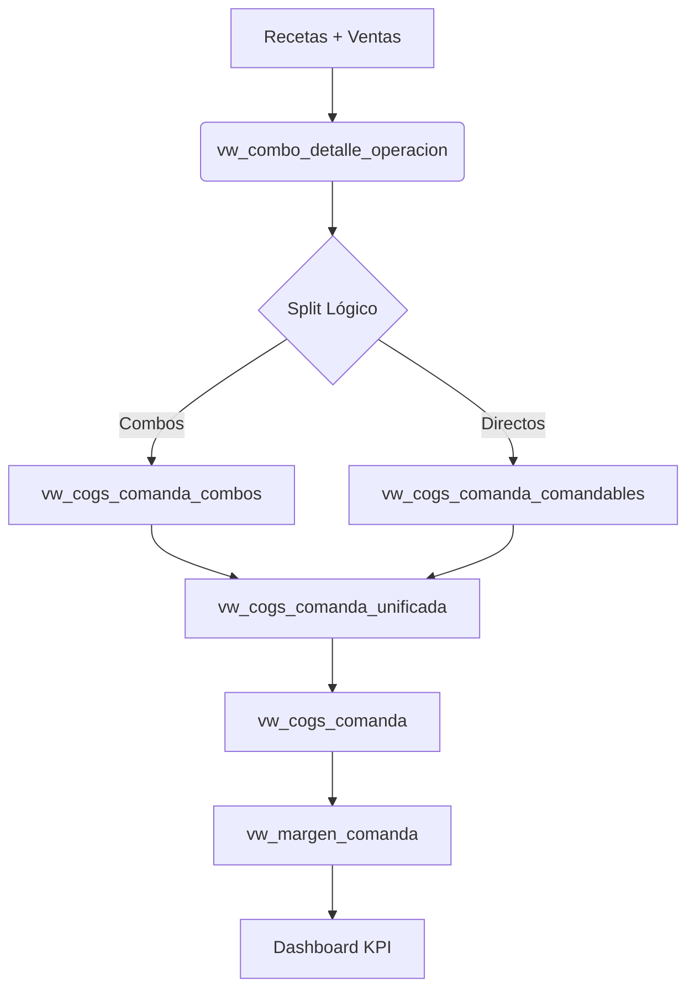

# 📟 Guía Técnica: Lógica de WAC y COGS

> **Estatus:** Vigente
> **Fecha:** 2026-02-13 | **Actualizado:** 2026-03-21 (migración a `cache_wac_producto`)

Este documento detalla la arquitectura técnica para la determinación del **Costo Promedio Ponderado (WAC)** y su flujo hasta el cálculo del **Costo de Ventas (COGS)** y Margen en el sistema.

> **Nota (2026-03-21):** Las vistas `vw_cogs_comanda_combos` y `vw_cogs_comanda_comandables` fueron migradas de `vw_wac_producto_almacen` / `vw_wac_global_producto` a `cache_wac_producto.wac_actual` (promedio móvil). Ver detalle en `docs/logica_flujos/discrepancia_cogs_kpi_vs_v9.md` sección 10 y `docs/sql/migracion_cogs_a_cache_wac.sql`.

## 1. Arquitectura de Vistas (Pipeline de Datos)

El sistema utiliza un modelo de trazabilidad en cascada que separa la lógica de combos (que requieren desglose) de los productos directos (comandables).



## 2. Definición de Costo (WAC)

La fuente de verdad para el costo unitario es la tabla **`cache_wac_producto`** (columna `wac_actual`), mantenida automáticamente por el trigger `trg_wac_after_insert_detalle` con un algoritmo de **promedio móvil incremental**.

**Fórmula WAC (Promedio Móvil):**

```
Nuevo WAC = (WAC_actual × Stock_actual + Cantidad_nueva × Costo_nuevo) / (Stock_actual + Cantidad_nueva)
```

> **Histórico:** Hasta el 2026-03-21, las vistas de COGS usaban `vw_wac_producto_almacen` (promedio ponderado de todos los ingresos históricos: `SUM(cant × precio) / SUM(cant)`). Este método fue reemplazado por subvaluar el costo en contextos inflacionarios (ver `docs/analisis_wac_cogs_margen.md` sección 6.1).

## 3. Detalle de Vistas Críticas

### 3.1 `vw_cogs_comanda_combos` (NÚCLEO DEL CÁLCULO)

Esta vista implementa la corrección crítica para evitar la duplicación de costos en combos.

- **Fuente de Cantidad:** `vw_combo_detalle_operacion` (desglose de componentes).
- **Fuente de Costo:** `cache_wac_producto.wac_actual` (promedio móvil).
- **Lógica:**
  Calcula el consumo base real del insumo y lo multiplica por el WAC de caché, eliminando el riesgo de multiplicar N veces por N lotes históricos.

```sql
SELECT
    cdo.id_operacion, cdo.id_comanda, cdo.id_barra,
    SUM(
        (CASE WHEN cdo.ind_paq_detalle=1 THEN cdo.cantidad
              ELSE cdo.cantidad / NULLIF(ap.cantidad_detalle, 0) END)
        * COALESCE(w.wac_actual, 0)
    ) AS cogs_comanda
FROM vw_combo_detalle_operacion cdo
JOIN alm_producto ap ON ap.id = cdo.id_producto
LEFT JOIN cache_wac_producto w ON w.id_producto = cdo.id_producto AND w.id_almacen = 1
GROUP BY cdo.id_operacion, cdo.id_comanda, cdo.id_barra
```

### 3.2 `vw_cogs_comanda_unificada`

Simplemente une (`UNION ALL`) los costos calculados de:

1.  **Combos/Tragos** (`vw_cogs_comanda_combos`)
2.  **Productos Directos** (`vw_cogs_comanda_comandables` - ej. botellas cerradas, sodas).

### 3.3 `vw_margen_comanda`

Es la vista final que consume `fetch.php`.

- **Ventas:** Suma directa de `sub_total` de la comanda.
- **COGS:** COGS unificado (`vw_cogs_comanda`).
- **Margen:** `Ventas - COGS`.

## 4. Implementación en Dashboard

El endpoint `fetch.php` consulta exclusivamente `vw_margen_comanda` filtrando por la operativa activa:

```php
SELECT
    SUM(total_venta) as ventas,
    SUM(cogs_comanda) as cogs,
    SUM(margen_comanda) as margen
FROM vw_margen_comanda
WHERE id_operacion = ...
```

## 5. Auditoría de Datos

Para validar inconsistencias, revisar en este orden:

1.  **¿Costo Unitario Erróneo?**
    Revisar `cache_wac_producto`. Si el `wac_actual` está mal, verificar que el trigger `trg_wac_after_insert_detalle` esté activo y que los ingresos recientes en `alm_detalle_ingreso` tengan `precio_costo` correcto.

2.  **¿Cantidad Errónea?**
    Revisar `vw_combo_detalle_operacion`. Verificar recetas y factores de conversión.

3.  **¿Cálculo por Comanda mal?**
    Revisar `vw_cogs_comanda_combos`. Confirmar que cruza con el producto correcto.

---

_Este documento reemplaza a las antiguas guías `consultas_cogs_wac.md`._
