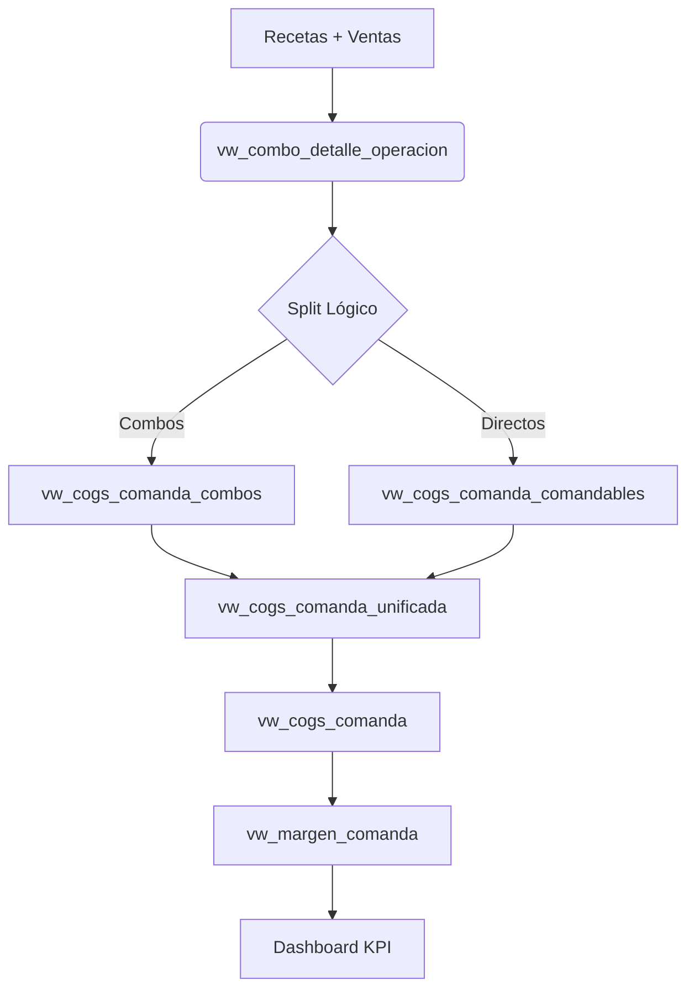

# 📟 Guía Técnica: Lógica de WAC y COGS

> **Estatus:** Vigente (Actualizado post-implementación `Documento_Maestro_COGS_WAC_BackStage_ACTUALIZADO`)
> **Fecha:** 2026-02-13

Este documento detalla la arquitectura técnica para la determinación del **Costo Promedio Ponderado (WAC)** y su flujo hasta el cálculo del **Costo de Ventas (COGS)** y Margen en el sistema.

## 1. Arquitectura de Vistas (Pipeline de Datos)

El sistema utiliza un modelo de trazabilidad en cascada que separa la lógica de combos (que requieren desglose) de los productos directos (comandables).



## 2. Definición de Costo (WAC)

La fuente única de verdad para el costo unitario es la vista **`vw_wac_producto_almacen`**.
Esta vista calcula el WAC histórico global basándose en todos los ingresos habilitados (`alm_ingreso`), independientemente de la operativa actual.

**Fórmula WAC Global:**
```sql
SUM(cantidad_ingreso * precio_costo) / SUM(cantidad_ingreso)
```

## 3. Detalle de Vistas Críticas

### 3.1 `vw_cogs_comanda_combos` (NÚCLEO DEL CÁLCULO)
Esta vista implementa la corrección crítica para evitar la duplicación de costos en combos.

- **Fuente de Cantidad:** `vw_combo_detalle_operacion` (desglose de componentes).
- **Fuente de Costo:** `vw_wac_producto_almacen` (Costo global único).
- **Lógica:**
  Calcula el consumo base real del insumo y lo multiplica por el WAC global único, eliminando el riesgo de multiplicar N veces por N lotes históricos.

```sql
SELECT 
    ...
    SUM( 
        (CASE WHEN ind_paq_detalle=1 THEN cantidad ELSE cantidad/factor END) * wac.wac_global 
    ) as cogs_comanda
FROM ...
JOIN vw_wac_producto_almacen wac ON ...
GROUP BY id_comanda
```

### 3.2 `vw_cogs_comanda_unificada`
Simplemente une (`UNION ALL`) los costos calculados de:
1.  **Combos/Tragos** (`vw_cogs_comanda_combos`)
2.  **Productos Directos** (`vw_cogs_comanda_comandables` - ej. botellas cerradas, sodas).

### 3.3 `vw_margen_comanda`
Es la vista final que consume `fetch.php`.
- **Ventas:** Suma directa de `sub_total` de la comanda.
- **COGS:** COGS unificado (`vw_cogs_comanda`).
- **Margen:** `Ventas - COGS`.

## 4. Implementación en Dashboard

El endpoint `fetch.php` consulta exclusivamente `vw_margen_comanda` filtrando por la operativa activa:

```php
SELECT 
    SUM(total_venta) as ventas,
    SUM(cogs_comanda) as cogs,
    SUM(margen_comanda) as margen
FROM vw_margen_comanda
WHERE id_operacion = ...
```

## 5. Auditoría de Datos

Para validar inconsistencias, revisar en este orden:

1.  **¿Costo Unitario Erróneo?**
    Revisar `vw_wac_producto_almacen`. Si el WAC está mal aquí, hay un error en los ingresos (`alm_ingreso`).

2.  **¿Cantidad Errónea?**
    Revisar `vw_combo_detalle_operacion`. Verificar recetas y factores de conversión.

3.  **¿Cálculo por Comanda mal?**
    Revisar `vw_cogs_comanda_combos`. Confirmar que cruza con el producto correcto.

---
*Este documento reemplaza a las antiguas guías `consultas_cogs_wac.md`.*
